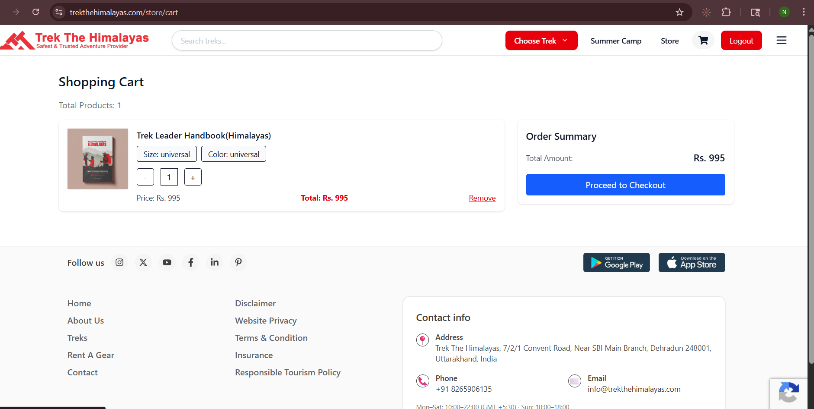
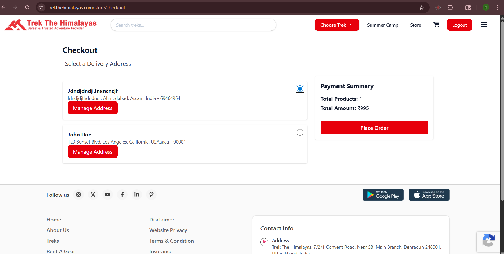
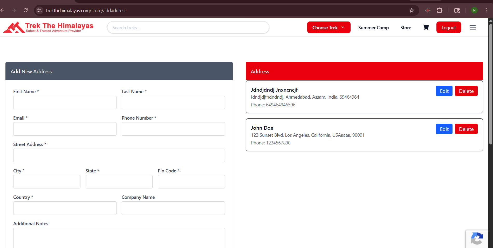
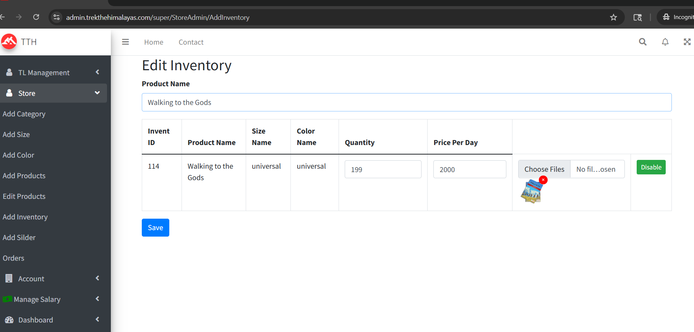
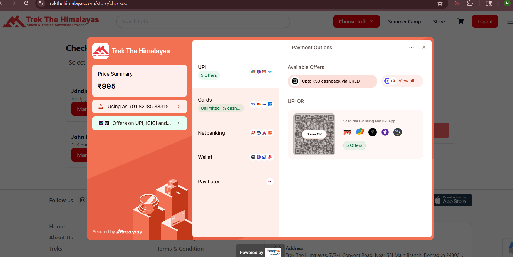

## 🔌 Store API Development

I developed a complete **Store Backend API** using ASP.NET Core Web API to manage product browsing, cart operations, orders, and payments.

---

### 📌 Key Functionalities

* Product & Category Management
* Product Variants (Size & Color)
* Cart Management (Add/Remove/Update)
* Booking & Order Creation
* Razorpay Payment Integration
* Inventory Update after Payment
* User Address Management
* Order History

---

### 🔗 Sample Endpoints

#### 🛍️ Products

* GET /api/Store/GetSlider
* GET /api/Store/AllCategories
* GET /api/Store/AllProducts
* GET /api/Store/ProductByCategory/{categoryId}

#### 🎯 Variants

* GET /api/Store/GetSizes/{productId}
* GET /api/Store/GetColors/{productId}
* GET /api/Store/GetVarientBySizeAndColor/{productId}/{sizeId}/{colorId}

#### 🛒 Cart (JWT Required)

* POST /api/Store/AddToCart/{productId}/{quantity}/{variantId}
* GET /api/Store/CartItems
* POST /api/Store/RemoveProductFromCart/{productId}/{variantId}
* POST /api/Store/RemoveQuantityFromCart/{productId}/{quantity}/{variantId}

#### 💳 Orders & Payment

* POST /api/Store/CreateBooking/{bookingId}/{addressId}
* POST /api/Store/HandlePaymentSuccess

#### 👤 User

* GET /api/Store/UserDetails
* GET /api/Store/UserOrders
* POST /api/Store/UserAddress
* GET /api/Store/GetUserAddress
* POST /api/Store/DeleteAddress/{id}
* POST /api/Store/UpdateUserAddress

---

### 🔐 Authentication

Most APIs are secured using **JWT Authentication**.

---

### 🌐 Note

These APIs are part of a production system and require:

* Valid authenticated user
* Proper booking flow
* Live backend environment

So direct public testing is restricted.

---

### 🧪 API Testing

* Tested using Postman
* Integrated with live server
* Validated request/response handling

  ## 📸 Screenshots

### 🛍️ Store Products

### 📦 Product Details

### 🛒 Cart

### 📍 Select Address

### ➕ Add / Edit Address

### 🧾 Inventory Management

### 💳 Payment (Razorpay)

